# CoreScout

**Your AI forgets everything between sessions. CoreScout lets the computer remember what went wrong, test what actually fixes it, and tell the next AI.**

[](https://crates.io/crates/corescout-cli)
[](https://github.com/Mattbusel/corescout/releases/latest)
[](#licence)

<p align="center">
  
</p>

Free, open source, and local-first: no account, no server, no telemetry. Written in Rust, with a desktop app and an [MCP](docs/MCP.md) server so Claude Code, Claude Desktop, Cursor or any MCP client can ask it questions.

## Install

| You have | Get |
| --- | --- |
| Windows 10 or 11 | [`CoreScoutSetup.exe`](https://github.com/Mattbusel/corescout/releases/latest) (desktop app + background service + MCP bridge) |
| Mac (Apple Silicon or Intel) or Linux | the `.tar.gz` for your machine from [Releases](https://github.com/Mattbusel/corescout/releases/latest) |
| Rust | `cargo install corescout-cli corescout-service corescout-mcp` |

No admin rights, and no Node, Python, WSL or Docker. The downloads are not signed yet, so Windows may say "unknown publisher" (**More info**, then **Run anyway**) and a Mac wants right-click, **Open**. Every file's SHA-256 is in `SHA256SUMS.txt` on the release page.

## Three steps

1. **Install it** (above). It starts watching the machine straight away.
2. **Connect your AI.** For Claude Code that is one line:
   ```bash
   claude mcp add corescout --scope user -- "C:\Program Files\CoreScout\corescout-mcp.exe"
   ```
   The app's **AI** screen writes the config for other clients, and can add a hook so every tool call is recorded without the AI having to remember.
3. **Work as usual.** Before something risky, your AI can ask "what goes wrong here?" and get an answer that comes with its evidence.

## A real answer from a real machine

<p align="center">
  
</p>

Those numbers are what CoreScout returned on the author's PC on 2026-10-04, after a few weeks of real use. It caught a rebuild script that failed every time and was never checked afterwards. It has **not** yet promoted anything to Verified there, because a claim only gets that label after enough coin-flip trials. It would rather tell you that than invent a win.

## Seen together vs. Verified

<p align="center">
  
</p>

Most tools that "learn" just notice that two things happened together and act on it. That is how you end up with superstitions. CoreScout keeps the two apart, and the labels never blur:

| label | means |
|---|---|
| **Seen together** | Two things kept happening together. CoreScout has not tested whether one causes the other. |
| **Verified** | CoreScout let a coin flip decide whether to try the change, then measured the difference. |

It also never prints `0%` for something it has never measured. A capability that has never run reads *never used*, because zero out of zero is not zero per cent.

## The problem

Your AI starts every session from nothing. The build that fails the same way
each time, the deploy that reports success forty seconds before the service is
reachable, the test that only breaks when the machine is busy: it rediscovers
all of that, every time, and then the window closes.

Nobody writes any of it down, because the thing that would know is the
computer, and computers do not learn from their own experience.

> The model doesn't learn from every task. Its computer does.

## What CoreScout does

1. **Sees.** It observes the machine several times a second, and observes what
   your AI does to it: commands, exit codes, files touched, retries, and (the
   part that matters most) whether anything actually checked the result.
2. **Learns.** It notices what recurs. Which operations fail here, what the
   runs that worked had in common, which state the machine was in at the time.
3. **Verifies.** Then it does the part almost nobody does. A correlation is not
   a cause, so on a small fraction of occasions CoreScout decides by coin flip
   rather than by belief, and only those trials support a claim that one thing
   causes another.
4. **Improves.** What survives becomes a capability, with its evidence
   attached. You approve it. Your AI can then use it, and so can the next AI
   you connect, because what was learned belongs to the machine.

Everything stays on your computer. No account, no server, no telemetry.

## What you will see

After a while, the Home screen says something like:

```
Your computer is learning how to work with Claude Code.

Today
  3 useful patterns learned
  1 capability created
  2 beliefs retired

Latest
  Regenerate schema, then build            Verified
  Builds here read a generated file that goes stale.
  strong evidence · 94% of 12 uses worked
```

Open any of it and you get the evidence: what was observed, how many times,
whether it was tested or merely noticed, what the alternative was, and what
happened. That is the whole point. A tool that tells you what to do without
telling you how it knows is asking for trust it has not earned.

## How much it may do

Four modes, and you can change them at any time.

| | |
|---|---|
| **Observe** | Watches and learns. Changes nothing. |
| **Suggest** | Recommends improvements. You approve every change. *(the default)* |
| **Assist** | Makes small reversible changes on its own. Anything bigger waits for you. |
| **Autopilot** | Applies changes it has verified, inside limits you set. |

Raising the mode never widens what CoreScout may touch; that is a separate
setting, and no mode overrides it. There is a **Pause** that stops everything
immediately, and it is checked before anything else in the system. See
[SECURITY.md](docs/SECURITY.md).

## Command line

```
corescout run -- <cmd>    Run something, measure it exactly, record it
corescout connect         Set an AI up to report its work automatically
corescout status          Is it running, and what is connected
corescout learned         Everything it has learned
corescout explain <id>    The evidence behind one of those
corescout failures        Operations that recur and go wrong here
corescout hypotheses      What it is testing and cannot yet answer
corescout ai setup        How to connect an AI
corescout mode assist     Change how much it may do
corescout pause           Stop everything now
corescout privacy         Exactly what is stored, and where
```

`--json` on any of them gives the same object the application receives.

## What is actually here

```text
your machine
     ↓
computational mirror        what this computer physically is, right now
     ↓
machine experience          what it has been like to be this machine
     ↓
science                     falsifiable claims, and what refutes them
     ↓
concepts                    structure it found and named itself
     ↓
AI operational experience   what working with an AI has taught it
     ↓
capabilities                procedures that survived being tested
     ↓
your AI                     through one standard tool interface
     ↓
bounded changes             scoped, reversible, audited, visible
     ↓
your machine again
```

- [PRODUCT.md](docs/PRODUCT.md): what each screen is for and why it is worded that way
- [DEMO.md](docs/DEMO.md): a real trap, built for real, with and without an experienced computer
- [MCP.md](docs/MCP.md): the tools your AI gets, and how to connect one
- [CAPABILITIES.md](docs/CAPABILITIES.md): how a correlation becomes something runnable
- [PRIVACY.md](docs/PRIVACY.md): everything that is stored, and where
- [SECURITY.md](docs/SECURITY.md): the boundaries, and how they are enforced
- [WINDOWS.md](docs/WINDOWS.md): building, packaging, signing
- [STORE.md](docs/STORE.md): the Microsoft Store package, and what a submission needs
- [ARCHITECTURE_PRODUCT.md](docs/ARCHITECTURE_PRODUCT.md): the product layers and the rules they follow
- [ARCHITECTURE.md](docs/ARCHITECTURE.md): the research crate graph and what each layer may not do

## The first run on real hardware

The first time this ran on hardware (a 13th Gen Intel Core i7-13700KF, 16
physical cores, 24 logical), it made over 900 reflections in 36 seconds:

```text
86 observable parts × 9 channels
32 recurring states discovered, which nothing told it to look for
3 concepts promoted, 29 refused
knowing which state it was in reduced prediction error by 42.4%
```

Its own account of itself, generated from what it had measured:

> I distinguish 32 recurring states of myself, which I found rather than being
> told about.

> I do not predict my own next state better than assuming nothing changes.

Both of those are in [REAL.md](docs/REAL.md), along with the lineage experiment
that returned **−4.1%** and the four bugs only real hardware could expose. The
project's habit is to publish the results that go the wrong way, and the
product kept it.

## The research underneath

CoreScout began as an experiment about whether a machine can discover useful
structure in itself: falsifiable hypotheses, concepts it coins and refuses,
association held apart from causal evidence, beliefs withdrawn when the
evidence ages out. All of that is still here and still runs, under
`corescout-lab`.

- [MIRROR.md](docs/MIRROR.md): the primitive everything sits on
- [SCIENCE.md](docs/SCIENCE.md): falsification, and what makes a claim risky
- [CREDULITY.md](docs/CREDULITY.md): where acting on a correlation is dangerous
- [ONTOLOGY.md](docs/ONTOLOGY.md): concepts a machine coins for itself
- [RESEARCH.md](RESEARCH.md): the whole account, including what failed

## Building it

`pwsh scripts/release.ps1` builds `CoreScoutSetup.exe` into `dist/` (details in
[WINDOWS.md](docs/WINDOWS.md)); `cargo build --release -p corescout-cli -p
corescout-service -p corescout-mcp` builds just the programs.

```bash
cargo test --workspace       # ~1,300 tests
cargo clippy --workspace --all-targets
cargo fmt --all -- --check
pwsh scripts/release.ps1     # installers into dist/
```

The desktop shell is deliberately outside the Cargo workspace, so the tests
above still run in seconds.

## Privacy Policy

CoreScout is local-first. Everything it records stays in
`%LOCALAPPDATA%\CoreScout\` on the machine that produced it.

- **Collected.** Processor layout and live performance counters; the commands
  and tool calls AI clients make, with credentials stripped as the data enters;
  exit codes, durations, retries, and whether anything verified the result;
  the folder each piece of work happened in; when each AI session ran.
- **Never collected.** The contents of your source files, your prompts, model
  responses, and any token, key or password.
- **Used for.** Forming and testing theories about how this machine behaves, so
  the AI tools connected to it can be told what has failed here before and what
  has been verified. Nothing else.
- **Shared with third parties.** Nothing. There is no network endpoint to share
  it with: no crate in this project opens an outbound connection.
- **Retention.** Kept until you delete it. The application deletes any category
  of it on request, and removing `%LOCALAPPDATA%\CoreScout\` removes all of
  it; CoreScout then starts again from nothing.
- **Contact.** https://github.com/Mattbusel/corescout/issues

Full policy: [docs/PRIVACY.md](docs/PRIVACY.md)

## Licence

MIT or Apache-2.0, at your option.
